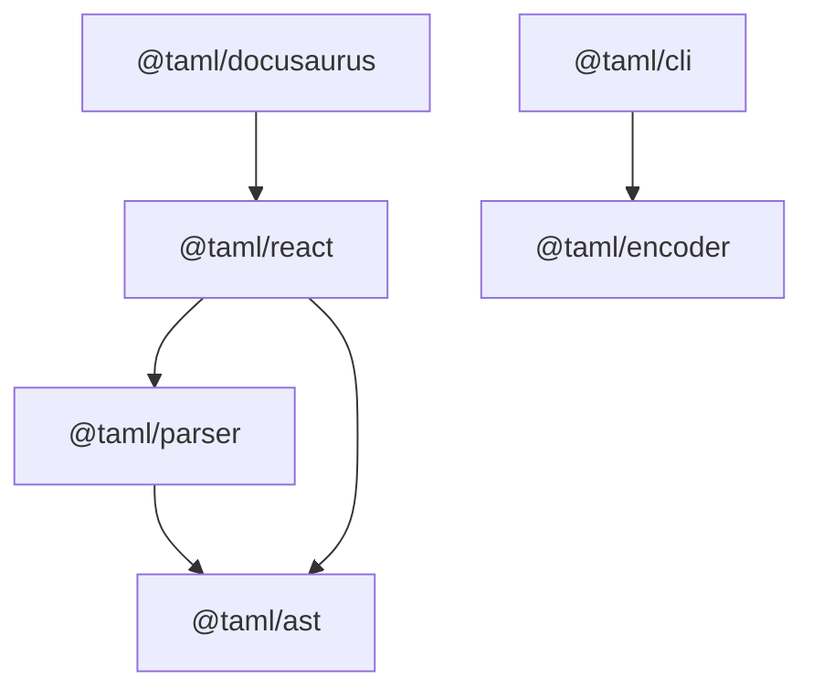

# @taml/ast

> Foundation package providing AST node types, visitor patterns, and tree traversal utilities for TAML documents.

[](https://www.npmjs.com/package/@taml/ast)
[](https://www.npmjs.com/package/@taml/ast)
[](https://www.typescriptlang.org/)
[](https://opensource.org/licenses/MIT)
[](https://github.com/suin/taml-ast/actions/workflows/ci.yml)
[](https://github.com/suin/taml-ast/actions/workflows/publish.yml)

## TAML Ecosystem

**TAML (Terminal ANSI Markup Language)** is a lightweight markup language for styling terminal output with ANSI escape codes. For the complete specification, visit the [TAML Specification Repository](https://github.com/suin/taml-spec).

### Package Dependencies



### Related Packages

#### Core Infrastructure

- **[@taml/ast](https://github.com/suin/taml-ast)** - Foundation package providing AST node types, visitor patterns, and tree traversal utilities for TAML documents.
- **[@taml/parser](https://github.com/suin/taml-parser)** - Robust parser that converts TAML markup strings into typed AST nodes with comprehensive error handling and validation.

#### Input/Output Tools

- **[@taml/encoder](https://github.com/suin/taml-encoder)** - Converts raw ANSI escape sequences into clean TAML markup for further processing and manipulation.
- **[@taml/cli](https://github.com/suin/taml-cli)** - Command-line tool for converting ANSI escape sequences to TAML format in batch operations.

#### Integration Packages

- **[@taml/react](https://github.com/suin/taml-react)** - React component that renders TAML markup as styled JSX elements with full TypeScript support and performance optimization.
- **[@taml/docusaurus](https://github.com/suin/taml-docusaurus)** - Docusaurus theme that automatically detects and renders TAML code blocks in documentation sites.

## Installation

### npm

```bash
npm install @taml/ast
```

### yarn

```bash
yarn add @taml/ast
```

### pnpm

```bash
pnpm add @taml/ast
```

### bun

```bash
bun add @taml/ast
```

### TypeScript Setup

This package includes TypeScript declarations out of the box. No additional setup is required for TypeScript projects.

```typescript
// ESM
import { createDocument, createElement, createText } from "@taml/ast";

// CommonJS
const { createDocument, createElement, createText } = require("@taml/ast");
```

## Quick Start

Here's a 5-minute introduction to building and working with TAML AST trees:

```typescript
import {
  createDocument,
  createElement,
  createText,
  visit,
  getAllText,
  getElementsWithTag,
} from "@taml/ast";

// Create AST nodes
const helloText = createText("Hello ");
const worldText = createText("World");
const exclamationText = createText("!");

// Build a tree: <red>Hello <bold>World</bold>!</red>
const boldElement = createElement("bold", [worldText]);
const redElement = createElement("red", [
  helloText,
  boldElement,
  exclamationText,
]);
const document = createDocument([redElement]);

// Extract all text content
const allText = getAllText(document);
console.log(allText); // "Hello World!"

// Find specific elements
const boldElements = getElementsWithTag(document, "bold");
console.log(boldElements.length); // 1

// Traverse with visitor pattern
visit(document, {
  visitElement: (node) => {
    console.log(`Found element: ${node.tagName}`);
  },
  visitText: (node) => {
    console.log(`Found text: "${node.content}"`);
  },
});
```

## Core Concepts

### AST Node Types

The TAML AST consists of three fundamental node types:

#### DocumentNode

The root container for all top-level nodes in a TAML document.

```typescript
interface DocumentNode extends TamlNode {
  type: "document";
  children: TamlNode[];
}
```

#### ElementNode

Represents a TAML tag with optional children (e.g., `<red>`, `<bold>`).

```typescript
interface ElementNode extends TamlNode {
  type: "element";
  tagName: TamlTag;
  children: TamlNode[];
}
```

#### TextNode

Contains plain text content without any styling.

```typescript
interface TextNode extends TamlNode {
  type: "text";
  content: string;
}
```

### Tree Structure

All nodes maintain parent-child relationships and position information:

```typescript
interface TamlNode {
  type: NodeType;
  start: number; // Start position in source text
  end: number; // End position in source text
  parent?: TamlNode; // Parent node reference
}
```

### TAML Tags

The library supports all 37 valid TAML tags from the specification:

- **Standard Colors**: `black`, `red`, `green`, `yellow`, `blue`, `magenta`, `cyan`, `white`
- **Bright Colors**: `brightBlack`, `brightRed`, `brightGreen`, etc.
- **Background Colors**: `bgBlack`, `bgRed`, `bgBrightBlue`, etc.
- **Text Styles**: `bold`, `dim`, `italic`, `underline`, `strikethrough`

## Usage Examples

### Building AST Trees

#### Manual Construction

```typescript
import {
  createDocument,
  createElement,
  createText,
  appendChild,
} from "@taml/ast";

// Create nodes
const document = createDocument();
const redElement = createElement("red");
const text = createText("Styled text");

// Build tree structure
appendChild(redElement, text);
appendChild(document, redElement);
```

#### Nested Elements

```typescript
// Create: <red>Error: <bold>File not found</bold></red>
const errorText = createText("Error: ");
const fileText = createText("File not found");
const boldElement = createElement("bold", [fileText]);
const redElement = createElement("red", [errorText, boldElement]);
const document = createDocument([redElement]);
```

### Traversing & Searching

#### Finding Nodes

```typescript
import { findAll, findFirst, getTextNodes } from "@taml/ast";

// Find all bold elements
const boldElements = findAll(
  document,
  (node) => node.type === "element" && node.tagName === "bold",
);

// Find first text node
const firstText = findFirst(document, (node) => node.type === "text");

// Get all text nodes
const textNodes = getTextNodes(document);
```

#### Text Extraction

```typescript
import { getAllText, getElementsWithTag } from "@taml/ast";

// Extract all text content
const content = getAllText(document);

// Get elements by tag
const redElements = getElementsWithTag(document, "red");
const boldElements = getElementsWithTag(document, "bold");
```

### Transforming Trees

#### Visitor Pattern

```typescript
import { visit, createCollectorVisitor } from "@taml/ast";

// Custom visitor
visit(document, {
  enterNode: (node) => console.log(`Entering ${node.type}`),
  exitNode: (node) => console.log(`Exiting ${node.type}`),
  visitElement: (node) => {
    if (node.tagName === "red") {
      console.log("Found red element");
    }
  },
});

// Collector visitor
const textCollector = createCollectorVisitor(
  (node): node is TextNode => node.type === "text",
);
visit(document, textCollector);
console.log(textCollector.nodes); // All text nodes
```

#### Async Operations

```typescript
import { visitAsync } from "@taml/ast";

await visitAsync(document, {
  visitText: async (node) => {
    // Async processing of text nodes
    await processText(node.content);
  },
});
```

#### Tree Transformation

```typescript
import { transform } from "@taml/ast";

// Transform to HTML
const html = transform(document, {
  visitDocument: (node) =>
    node.children.map((child) => transform(child, this)).join(""),
  visitElement: (node) => {
    const content = node.children
      .map((child) => transform(child, this))
      .join("");
    return `<span class="${node.tagName}">${content}</span>`;
  },
  visitText: (node) => node.content,
});
```

### Tree Manipulation

#### Adding and Removing Nodes

```typescript
import { appendChild, removeChild, replaceChild, cloneNode } from "@taml/ast";

// Add child
const newText = createText("New content");
appendChild(element, newText);

// Remove child
removeChild(newText);

// Replace child
const replacement = createText("Replacement");
replaceChild(element, newText, replacement);

// Clone subtree
const clone = cloneNode(element);
```

#### Navigation

```typescript
import {
  getRoot,
  getAncestors,
  getSiblings,
  getPreviousSibling,
  getNextSibling,
} from "@taml/ast";

// Navigate tree
const root = getRoot(textNode);
const ancestors = getAncestors(textNode);
const siblings = getSiblings(textNode);
const prev = getPreviousSibling(textNode);
const next = getNextSibling(textNode);
```

## Integration with TAML Ecosystem

### With Parser

```typescript
import { parse } from "@taml/parser";
import { visit, getAllText } from "@taml/ast";

// Parse TAML markup into AST
const ast = parse("<red>Hello <bold>World</bold>!</red>");

// Process the AST
const text = getAllText(ast);
visit(ast, {
  visitElement: (node) => console.log(`Element: ${node.tagName}`),
});
```

### With React

```typescript
import { createElement, createText } from '@taml/ast';
import { TamlRenderer } from '@taml/react';

// Create AST
const element = createElement('red', [
  createText('Hello '),
  createElement('bold', [createText('World')])
]);

// Render with React
function MyComponent() {
  return <TamlRenderer ast={element} />;
}
```

### With CLI Tools

```bash
# Convert ANSI to TAML, then parse to AST
echo -e "\033[31mHello\033[0m" | taml-cli encode | node -e "
  const { parse } = require('@taml/parser');
  const { getAllText } = require('@taml/ast');

  let input = '';
  process.stdin.on('data', chunk => input += chunk);
  process.stdin.on('end', () => {
    const ast = parse(input.trim());
    console.log(getAllText(ast));
  });
"
```

### Complete Pipeline Example

```typescript
import { encode } from '@taml/encoder';
import { parse } from '@taml/parser';
import { visit, getAllText, getElementsWithTag } from '@taml/ast';

// Complete ANSI → TAML → AST → Analysis pipeline
const ansiText = '\033[31mError:\033[0m \033[1mFile not found\033[0m';

// 1. Convert ANSI to TAML
const tamlMarkup = encode(ansiText);
console.log(tamlMarkup); // "<red>Error:</red> <bold>File not found</bold>"

// 2. Parse TAML to AST
const ast = parse(tamlMarkup);

// 3. Analyze AST
const plainText = getAllText(ast);
const redElements = getElementsWithTag(ast, 'red');
const boldElements = getElementsWithTag(ast, 'bold');

console.log('Plain text:', plainText);
console.log('Red elements:', redElements.length);
console.log('Bold elements:', boldElements.length);

// 4. Custom processing
visit(ast, {
  visitElement: (node) => {
    if (node.tagName === 'red') {
      console.log('Found error styling');
    }
  }
});
```

## API Reference

### Types and Constants

#### Core Types

```typescript
// Node types
type NodeType = "document" | "element" | "text";

// TAML tag types
type TamlTag =
  | "black"
  | "red"
  | "green"
  | "yellow"
  | "blue"
  | "magenta"
  | "cyan"
  | "white"
  | "brightBlack"
  | "brightRed"
  | "brightGreen"
  | "brightYellow"
  | "brightBlue"
  | "brightMagenta"
  | "brightCyan"
  | "brightWhite"
  | "bgBlack"
  | "bgRed"
  | "bgGreen"
  | "bgYellow"
  | "bgBlue"
  | "bgMagenta"
  | "bgCyan"
  | "bgWhite"
  | "bgBrightBlack"
  | "bgBrightRed"
  | "bgBrightGreen"
  | "bgBrightYellow"
  | "bgBrightBlue"
  | "bgBrightMagenta"
  | "bgBrightCyan"
  | "bgBrightWhite"
  | "bold"
  | "dim"
  | "italic"
  | "underline"
  | "strikethrough";

// Position information
interface Position {
  start: number;
  end: number;
  line: number;
  column: number;
}
```

#### Constants

```typescript
// Tag collections
const STANDARD_COLORS: readonly string[];
const BRIGHT_COLORS: readonly string[];
const BACKGROUND_COLORS: readonly string[];
const TEXT_STYLES: readonly string[];
const VALID_TAGS: Set<TamlTag>;
```

#### Type Guards

```typescript
// Tag validation
function isValidTag(tag: string): tag is TamlTag;
function isStandardColor(tag: TamlTag): boolean;
function isBrightColor(tag: TamlTag): boolean;
function isBackgroundColor(tag: TamlTag): boolean;
function isTextStyle(tag: TamlTag): boolean;

// Node type guards
function isDocumentNode(node: TamlNode): node is DocumentNode;
function isElementNode(node: TamlNode): node is ElementNode;
function isTextNode(node: TamlNode): node is TextNode;
```

### Node Operations

#### Factory Functions

```typescript
// Create nodes
function createDocument(
  children?: TamlNode[],
  start?: number,
  end?: number,
): DocumentNode;
function createElement(
  tagName: TamlTag,
  children?: TamlNode[],
  start?: number,
  end?: number,
): ElementNode;
function createText(content: string, start?: number, end?: number): TextNode;
```

#### Tree Manipulation

```typescript
// Modify tree structure
function appendChild(parent: DocumentNode | ElementNode, child: TamlNode): void;
function removeChild(child: TamlNode): void;
function replaceChild(
  parent: DocumentNode | ElementNode,
  oldChild: TamlNode,
  newChild: TamlNode,
): void;
function cloneNode(node: TamlNode): TamlNode;
```

#### Navigation

```typescript
// Tree navigation
function getRoot(node: TamlNode): DocumentNode;
function getAncestors(node: TamlNode): TamlNode[];
function getDepth(node: TamlNode): number;
function getSiblings(node: TamlNode): TamlNode[];
function getPreviousSibling(node: TamlNode): TamlNode | null;
function getNextSibling(node: TamlNode): TamlNode | null;
```

### Visitor Pattern

#### Interfaces

```typescript
// Visitor interface
interface Visitor {
  visitDocument?(node: DocumentNode): void;
  visitElement?(node: ElementNode): void;
  visitText?(node: TextNode): void;
  enterNode?(node: TamlNode): void;
  exitNode?(node: TamlNode): void;
}

// Transformer interface
interface Transformer<T = TamlNode> {
  visitDocument?(node: DocumentNode): T;
  visitElement?(node: ElementNode): T;
  visitText?(node: TextNode): T;
}

// Async visitor interface
interface AsyncVisitor {
  visitDocument?(node: DocumentNode): Promise<void>;
  visitElement?(node: ElementNode): Promise<void>;
  visitText?(node: TextNode): Promise<void>;
  enterNode?(node: TamlNode): Promise<void>;
  exitNode?(node: TamlNode): Promise<void>;
}
```

#### Visitor Functions

```typescript
// Core visitor functions
function visit(node: TamlNode, visitor: Visitor): void;
function transform<T>(node: TamlNode, transformer: Transformer<T>): T;
function visitAsync(node: TamlNode, visitor: AsyncVisitor): Promise<void>;
```

#### Helper Visitors

```typescript
// Specialized visitors
function createTypedVisitor<T extends TamlNode>(
  nodeTest: (node: TamlNode) => node is T,
  callback: (node: T) => void,
): Visitor;

function createCollectorVisitor<T extends TamlNode>(
  nodeTest: (node: TamlNode) => node is T,
): Visitor & { nodes: T[] };

function createCounterVisitor(): Visitor & {
  counts: { document: number; element: number; text: number };
};
```

### Traversal Utilities

#### Basic Traversal

```typescript
// Tree walking
function walk(node: TamlNode, callback: (node: TamlNode) => void): void;
function walkAsync(
  node: TamlNode,
  callback: (node: TamlNode) => Promise<void>,
): Promise<void>;
```

#### Search Functions

```typescript
// Finding nodes
function findAll(
  root: TamlNode,
  predicate: (node: TamlNode) => boolean,
): TamlNode[];
function findFirst(
  root: TamlNode,
  predicate: (node: TamlNode) => boolean,
): TamlNode | null;
function filter(
  root: TamlNode,
  predicate: (node: TamlNode) => boolean,
): TamlNode[];
```

#### Specialized Queries

```typescript
// Content extraction
function getAllText(root: TamlNode): string;
function getElementsWithTag(root: TamlNode, tagName: TamlTag): ElementNode[];
function getTextNodes(root: TamlNode): TextNode[];
function getElementNodes(root: TamlNode): ElementNode[];
```

#### Tree Analysis

```typescript
// Tree relationships
function contains(ancestor: TamlNode, descendant: TamlNode): boolean;
function getCommonAncestor(node1: TamlNode, node2: TamlNode): TamlNode | null;

// Tree properties
function isEmpty(node: TamlNode): boolean;
function countNodes(root: TamlNode): {
  document: number;
  element: number;
  text: number;
};
function getMaxDepth(root: TamlNode): number;

// Tree utilities
function flatten(root: TamlNode): TamlNode[];
function createDepthMap(root: TamlNode): Map<TamlNode, number>;
```

## Advanced Topics

### Performance Considerations

#### Memory Management

```typescript
// Efficient tree construction
const document = createDocument();
const elements = [];

// Build elements first, then add to tree
for (const data of largeDataSet) {
  elements.push(createElement(data.tag, [createText(data.content)]));
}

// Add all at once to minimize parent reference updates
elements.forEach((element) => appendChild(document, element));
```

#### Large Tree Traversal

```typescript
// Use early termination for large trees
function findFirstError(root: TamlNode): ElementNode | null {
  return findFirst(
    root,
    (node): node is ElementNode =>
      node.type === "element" && node.tagName === "red",
  ) as ElementNode | null;
}

// Prefer specific queries over general traversal
const redElements = getElementsWithTag(root, "red"); // Faster
// vs
const redElements2 = findAll(
  root,
  (node) => node.type === "element" && node.tagName === "red",
); // Slower
```

### Error Handling Patterns

```typescript
// Safe tree navigation
function safeGetText(node: TamlNode): string {
  try {
    return getAllText(node);
  } catch (error) {
    console.warn("Failed to extract text:", error);
    return "";
  }
}

// Validate tree structure
function validateTree(root: TamlNode): boolean {
  try {
    let isValid = true;
    visit(root, {
      enterNode: (node) => {
        if (node.parent && !contains(node.parent, node)) {
          isValid = false;
          throw new Error("Invalid parent reference");
        }
      },
    });
    return isValid;
  } catch {
    return false;
  }
}
```

### Integration Patterns

#### Parser Integration

```typescript
// Error-tolerant parsing workflow
import { parse, ParseError } from "@taml/parser";

function parseWithFallback(markup: string): DocumentNode {
  try {
    return parse(markup);
  } catch (error) {
    if (error instanceof ParseError) {
      // Create fallback AST with error information
      return createDocument([
        createElement("red", [createText("Parse Error: ")]),
        createText(error.message),
      ]);
    }
    throw error;
  }
}
```

#### Custom Serialization

```typescript
// Serialize AST to custom format
function serializeToJson(node: TamlNode): any {
  return transform(node, {
    visitDocument: (node) => ({
      type: "document",
      children: node.children.map((child) => serializeToJson(child)),
    }),
    visitElement: (node) => ({
      type: "element",
      tag: node.tagName,
      children: node.children.map((child) => serializeToJson(child)),
    }),
    visitText: (node) => ({
      type: "text",
      content: node.content,
    }),
  });
}
```

## Contributing

We welcome contributions! Please see our [Contributing Guide](CONTRIBUTING.md) for details.

### Development Setup

```bash
# Clone the repository
git clone https://github.com/suin/taml-ast.git
cd taml-ast

# Install dependencies
bun install

# Run tests
bun test

# Build the project
bun run build

# Lint and format
bun run lint
bun run format
```

### Testing

The project uses Bun for testing with comprehensive test coverage:

```bash
# Run all tests
bun test

# Run tests in watch mode
bun test --watch

# Run specific test file
bun test nodes.test.ts
```

## License

MIT © [suin](https://github.com/suin)

---

**Part of the TAML ecosystem** - Visit the [TAML Specification](https://github.com/suin/taml-spec) for more information about the Terminal ANSI Markup Language.
